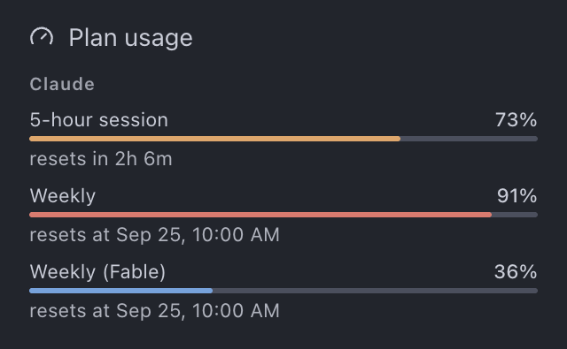
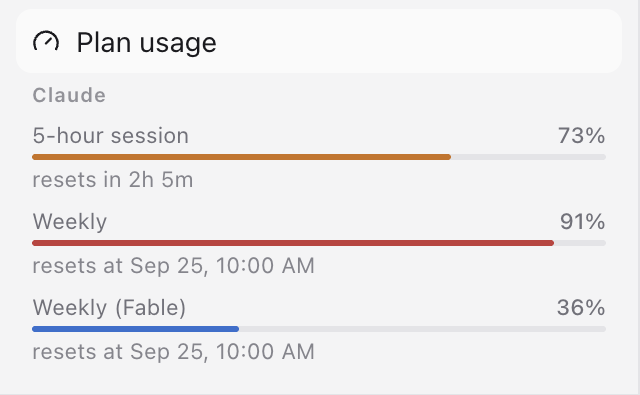
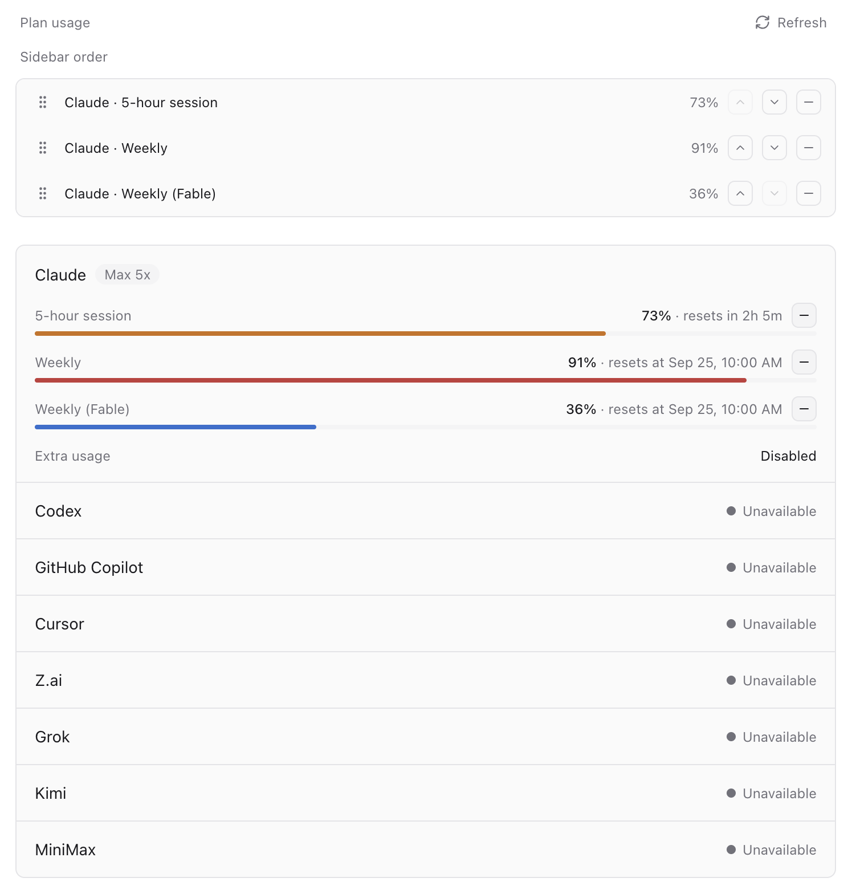
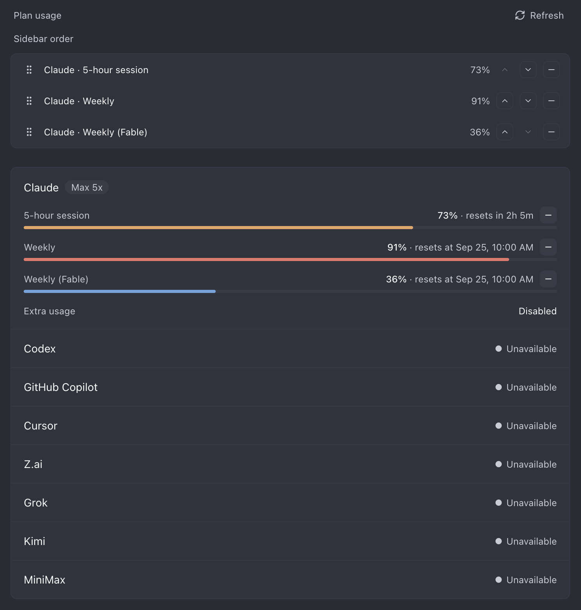
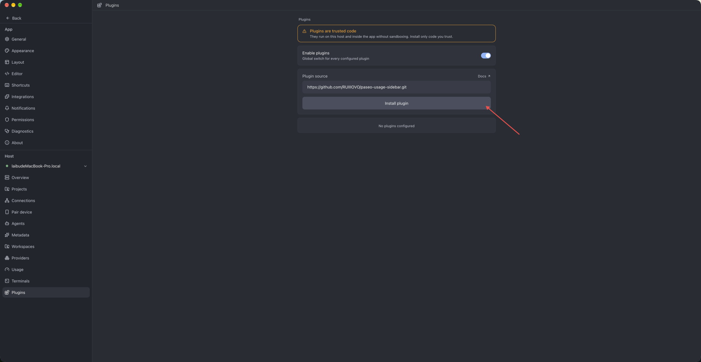
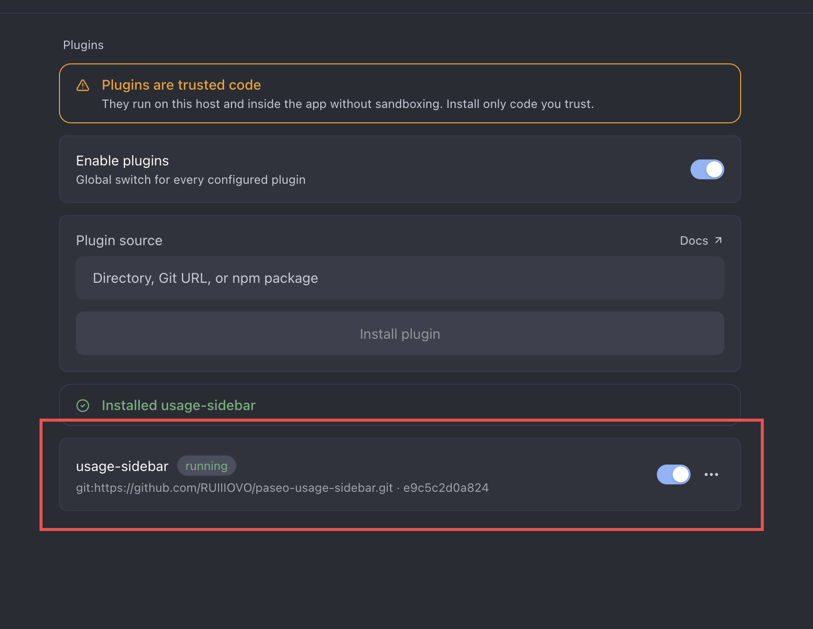

# Paseo Usage Sidebar 📊

<p align="center">
  <strong>A sleek and lightweight usage dashboard plugin for Paseo's sidebar.</strong>
</p>

<p align="center">
  <a href="./README.md">English</a> | <a href="./README.zh-CN.md">简体中文</a>
</p>

---

## 💡 Overview

**Paseo Usage Sidebar** is an elegant usage monitoring plugin designed for [Paseo](https://paseo.sh). It seamlessly integrates AI provider quotas and consumption tracking directly into your sidebar, featuring pinned mini progress bars and an expandable detailed panel to keep your usage visible at a glance.

**Zero configuration required**—it reads Paseo's own `provider.usage.list`, so the numbers always agree with **Settings → Usage**. No API keys, no vendor CLI, no second polling path.

<p align="center">
  
</p>

---

## ✨ Features

- 📊 **Pinned Mini Meters**: Compact progress bars embedded right below the sidebar item for effortless quota monitoring without page switching. *(Desktop and web only; the panel works everywhere.)*
- 🔍 **Expandable Detail Panel**: One-click access to a dashboard showing provider quotas, reset schedules, balances, and status.
- ⚡ **Zero Setup & Live Sync**: Refreshes every 60 seconds, and on demand from **Refresh**—no manual API key entry or configuration.
- 🎛️ **Pin, Hide & Reorder**: Choose exactly which quota windows live in the sidebar, and drag them into the order you want.
- 📈 **Pace Against the Clock**: `57% ▲12%` means twelve points ahead of a window only 45% elapsed; a tick on the bar marks where the clock stands. Green behind, orange 1–5 points ahead, red past that.
- 👤 **Whose Plan It Is**: Each provider is headed by its account — `Claude (you@example.com)` — and a subscription signed in on two providers, or two connected machines, renders once instead of twice.
- 🗂️ **Foldable Accounts**: Click an account heading in the sidebar meter to fold its rows away.
- 🎨 **Native Look & Feel**: Follows all seven built-in themes, picking up a theme switch without a reload.
- 🌐 **i18n Ready**: Localized into all nine languages Paseo ships—English, Simplified Chinese, Arabic, Spanish, French, Japanese, Korean, Portuguese (Brazil), and Russian.

The account address is the one thing Paseo does not report, so it is read — the address alone, read-only — from the provider CLI's own login file. See [docs/DESIGN.md](./docs/DESIGN.md) for exactly what is read, and for how pace, deduplication, and the cross-machine claim work.

---

## 📸 Preview

|           |                  Pinned Mini Meter                  |             Expandable Detail Panel             |
| :-------: | :-------------------------------------------------: | :---------------------------------------------: |
| **Light** |       |         |
| **Dark**  |  |  |

---

## 🚀 Quick Start

> Requires **Paseo 0.8.0 or later**. Paseo 0.7 and earlier cannot load this plugin.

### Installation

**Option A — From the app**

1. Open **Paseo** and go to **Settings → Plugins**.
2. Turn on **Enable plugins**.
3. Paste the repository URL into **Plugin source**:
   ```
   https://github.com/RUIIIOVO/paseo-usage-sidebar.git
   ```
4. Press **Install plugin**.



A successful install looks like this:



**Option B — From the command line**

```bash
paseo plugin add RUIIIOVO/paseo-usage-sidebar
```

### Usage

- **Quick Glance**: The sidebar shows a mini meter for every pinned quota window, directly under the **Plan usage** entry.
- **Detailed View**: Pick **Plan usage** in the sidebar, or run **Open plan usage** from the Command Center (`Cmd`/`Ctrl` + `K`).
- **Reorder & Customize**: Every window in the panel carries a **+ / −** button that pins it to, or hides it from, the sidebar. Drag rows in the **Sidebar order** block to change the order the meter paints.
- **Pace**: The **Pace** button in the panel header turns the arrow and the clock tick off on both surfaces.

---

## 🔄 Updating

Update with:

```bash
paseo plugin update usage-sidebar
```

---

## 🤝 Contributing

Issues and Pull Requests are welcome—see [CONTRIBUTING.md](./CONTRIBUTING.md) for what to run and how commits are written. If you find this plugin helpful, please consider giving it a ⭐️.

---

## 📄 License

This project is licensed under the [MIT License](./LICENSE).
